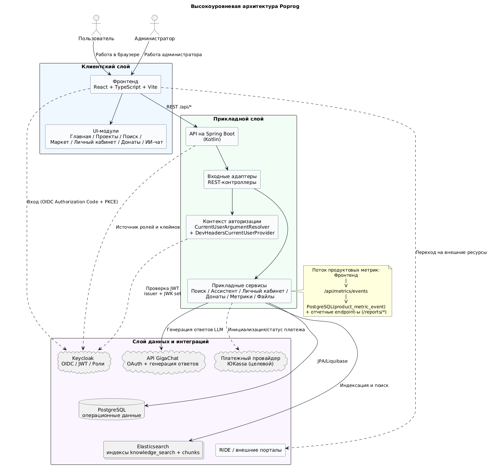

# Архитектурные схемы Poprog

В этой папке хранятся исходники и рендеры схем портала Poprog. Схемы фиксируются в GitHub, чтобы архитектура портала была доступна команде вместе с кодом и могла ревьюиться через Pull Request.

## Высокоуровневая схема

Схема описывает портал по уровням:

- клиентский слой: браузер пользователя, frontend на React, пользовательские модули портала;
- прикладной слой: backend API на Spring Boot, REST-контроллеры и прикладные сервисы;
- слой данных и интеграций: PostgreSQL, Elasticsearch, файловое хранилище, Keycloak, GigaChat, внешние источники данных;
- эксплуатационный слой: Nginx, Docker Compose, GitHub Actions и GHCR.

## Состав файлов

- `poprog-high-level-architecture.drawio` — редактируемый исходник высокоуровневой архитектуры для diagrams.net.
- `poprog-high-level-architecture.png` — рендер схемы для просмотра в GitHub Markdown.
- `poprog-high-level-architecture.puml` — текстовое PlantUML-представление той же схемы.
- `poprog-sequence-scenarios.drawio` — сценарные последовательности для ИИ-чата, widget-router, RAG-контекста и fallback-режимов.
- `poprog-sequence-scenarios.puml` — PlantUML-версия сценариев.
- `poprog-erd.drawio` — ERD базы знаний Poprog.
- `poprog-erd.puml` — PlantUML-версия ERD.

## Правило актуализации

При изменении интеграций, сетевой схемы, хранилищ, CI/CD или внешних сервисов нужно обновлять не только код и compose-файлы, но и соответствующую схему в этой папке. Это снижает риск ситуации, когда продакшн-устройство портала известно только из переписки или локальных файлов.
