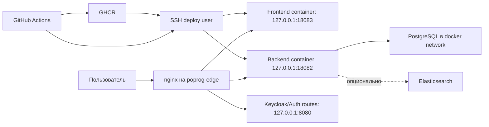

# Развертывание облачного портала POPROG

## Практическое описание развертывания

Развертывание портала выполнено как контейнерная поставка нескольких сервисов на виртуальную машину с публичным IP-адресом. В состав развернутой системы входят frontend-приложение, backend-сервис базы знаний, сервис авторизации на базе Keycloak, PostgreSQL для хранения данных и nginx как единая входная точка HTTP-трафика.

Цель выбранной схемы развертывания состоит в том, чтобы портал был доступен пользователю по основному адресу без дополнительных префиксов, а внутренние сервисы оставались закрытыми от прямого внешнего доступа. Пользователь обращается к `http://95.174.95.251/`, nginx принимает запрос и в зависимости от пути перенаправляет его либо на frontend-контейнер, либо на backend API, либо на сервис авторизации.

### Используемая инфраструктура

Для развертывания использовались две виртуальные машины. Публичная виртуальная машина `poprog-edge` принимает внешний HTTP-трафик, содержит nginx и контейнеры публичного контура. Внутренняя виртуальная машина `poprog-inner` предназначена для размещения внутренних сервисов и доступа через приватную сеть. Такая схема была выбрана для экономии публичных IP-адресов и для ограничения внешнего доступа к служебным компонентам.

На публичной машине были настроены:

- Docker и Docker Compose для запуска контейнеров;
- nginx как reverse proxy;
- контейнер frontend-приложения;
- контейнер backend-приложения;
- контейнеры сервиса авторизации;
- PostgreSQL-контейнер, переиспользуемый сервисами;
- SSH-доступ для deploy-пользователя, используемый GitHub Actions.

Образы приложений публикуются в GitHub Container Registry. Для каждого сервиса используется отдельный workflow GitHub Actions, поэтому backend и frontend можно обновлять независимо. Это уменьшает время деплоя и снижает риск случайного перезапуска сервисов, которые не менялись.

### Логическая схема



### Маршрутизация nginx

nginx используется как единая точка входа. Основной портал открывается с корневого пути `/`, без префикса `/portal`. Это важно для пользовательского восприятия: портал выглядит как основной сайт на публичном IP, а не как вложенное приложение.

Ключевые маршруты:

- `/` и пользовательские страницы frontend-приложения проксируются на `127.0.0.1:18083`;
- `/api/` проксируется на backend `127.0.0.1:18082/api/`;
- `/portal-api/` проксируется на backend без добавления `/api`, используется frontend-сборкой как базовый адрес API;
- `/actuator/` проксируется на backend health endpoints;
- `/files/` проксируется на backend для отдачи загруженных PDF-файлов;
- `/swagger-ui/` и `/v3/` проксируются на OpenAPI-документацию backend;
- `/admin`, `/realms`, `/resources` проксируются на Keycloak;
- `/portal` и `/portal/...` перенаправляются на корневые маршруты для обратной совместимости со старыми ссылками.

Такая схема позволяет пользователю работать с порталом по коротким адресам: `/home`, `/works`, `/publications`, `/market`, `/account`. При этом API и служебные маршруты остаются технически отделенными.

### Backend deployment

Backend реализован на Kotlin и Spring Boot. Для production-поставки используется Dockerfile, который собирает исполняемый JAR и упаковывает его в контейнер. Контейнер публикуется в `ghcr.io/egorkuzn/poprog-knowledge-base-back`.

Backend-контейнер запускается через `deploy/compose/docker-compose.prod.yml`. Compose-файл описывает сервис `portal-backend`, подключает его к существующей docker-сети `auth-ride_default`, пробрасывает внутренний порт `8080` на локальный порт машины `127.0.0.1:18082` и подключает volume для хранения файлов.

Основные параметры backend:

- `SPRING_PROFILES_ACTIVE=prod` задает профиль окружения;
- `DB_URL=jdbc:postgresql://postgres:5432/poprog_kb` указывает на PostgreSQL внутри docker-сети;
- `DB_USER` и `DB_PASSWORD` берутся из `.env`, который хранится на сервере и не коммитится;
- `FILES_STORAGE_DIR=/app/storage` задает директорию файлов внутри контейнера;
- `FILES_BASE_URL=/files` позволяет отдавать PDF через публичный nginx-маршрут;
- `SEARCH_ENABLED=true` включает поисковый сервис;
- `ELASTICSEARCH_URIS=http://elasticsearch:9200` оставлен как адрес полнотекстового индекса;
- `GIGACHAT_ENABLED=false` отключает внешнюю LLM-интеграцию в production-сборке до полной настройки секретов;
- `KEYCLOAK_AUTH_ENABLED=true` включает проверку JWT-токенов Keycloak;
- `KEYCLOAK_ISSUER_URI`, `KEYCLOAK_JWK_SET_URI`, `KEYCLOAK_REALM`, `KEYCLOAK_CLIENT_ID` и `KEYCLOAK_REQUIRED_AUDIENCE` описывают realm и client портала;
- `KEYCLOAK_ADMIN_REALM`, `KEYCLOAK_ADMIN_CLIENT_ID`, `KEYCLOAK_ADMIN_USERNAME` и `KEYCLOAK_ADMIN_PASSWORD` используются только backend-сервисом для создания новых учетных записей через Keycloak Admin API;
- `AUTH_DEV_HEADERS_ENABLED=false` отключает тестовую авторизацию через заголовки в production.

Во время эксплуатации была обнаружена проблема: при недоступности DNS-имени `elasticsearch` backend не поднимался, и nginx отдавал `502 Bad Gateway` на `/api/*`. Для устранения этой проблемы была изменена стратегия поиска. Теперь backend не зависит жестко от Spring Data Elasticsearch repositories на этапе старта. Поисковые адаптеры используют `ElasticsearchOperations` и обрабатывают недоступность индекса как деградацию функциональности, а не как критическую ошибку запуска приложения. Дополнительно реализован fallback-поиск по PostgreSQL, поэтому базовый поиск по публикациям и студенческим работам продолжает работать даже без Elasticsearch.

### Frontend deployment
Frontend реализован на React, TypeScript и Vite. Для production-сборки используется Dockerfile, который сначала собирает статические файлы, а затем размещает их в nginx-контейнере. Образ публикуется в `ghcr.io/egorkuzn/poprog-knowledge-base-front`.

При сборке frontend задаются build arguments:

- `VITE_API_BASE_URL=/portal-api`;
- `VITE_DEBUG_HEADERS_ENABLED=false`;
- `VITE_RIDE_CONSOLE_URL=/admin/master/console/`;
- `VITE_RIDE_SIGNUP_URL=/account`.

Frontend-контейнер запускается на сервере на локальном порту `127.0.0.1:18083`. Наружу порт контейнера не открывается напрямую. Доступ к нему осуществляется только через nginx.

Для маршрутизации SPA используется сборка с `--base=/`, чтобы приложение корректно работало от корня сайта. Это устранило проблему, когда страницы открывались через `/portal/...` и пользователь видел лишний технический префикс в URL.

### GitHub Actions и CI/CD

Для backend и frontend настроены независимые workflow GitHub Actions. Общий принцип одинаковый:

1. При pull request запускается проверка качества: установка зависимостей, тесты и сборка.
2. При push в `main` после успешных проверок собирается Docker-образ.
3. Образ публикуется в GitHub Container Registry.
4. GitHub Actions подключается к серверу по SSH через отдельного deploy-пользователя.
5. На сервер загружается или генерируется docker-compose конфигурация.
6. Docker Compose скачивает новый образ и перезапускает только изменившийся сервис.
7. После запуска выполняется smoke check.

Для backend smoke check проверяет:

- `http://127.0.0.1:18082/actuator/health` внутри сервера;
- публичный `http://<host>/actuator/health`;
- публичный `http://<host>/api/publications/grouped`.

Для frontend smoke check проверяет доступность корневого маршрута сайта и наличие статических ресурсов.

Секреты не хранятся в репозитории. В GitHub Actions используются repository/environment secrets:

- `DEPLOY_HOST` - адрес сервера;
- `DEPLOY_USER` - пользователь для деплоя;
- `DEPLOY_SSH_PRIVATE_KEY` - приватный ключ deploy-пользователя;
- `GITHUB_TOKEN` - токен GitHub Actions для публикации в GHCR.

Пароли базы данных и другие runtime-настройки хранятся в `.env` на сервере. Workflow проверяет наличие `.env`, но не выводит его содержимое в логи.

### Функциональные требования к deployment-контуру

Высокий приоритет:

- Система должна открывать портал по основному адресу без обязательного префикса `/portal`.
- Система должна обслуживать пользовательские маршруты frontend-приложения через единый nginx reverse proxy.
- Система должна проксировать API-запросы frontend-приложения к backend-сервису.
- Система должна отдавать загруженные PDF-файлы через публичный маршрут `/files/`.
- Система должна поддерживать раздельный деплой frontend и backend.
- Система должна запускать backend с подключением к PostgreSQL и автоматическим применением миграций Liquibase.
- Система должна выполнять smoke check после production-деплоя.
- Система должна сохранять работоспособность основных API при недоступности Elasticsearch.
- Система должна предоставлять health endpoint для проверки состояния backend.

Средний приоритет:

- Система должна публиковать Docker-образы в GitHub Container Registry.
- Система должна поддерживать rollback за счет использования образов с тегами commit SHA.
- Система должна сохранять загруженные файлы между перезапусками контейнера backend.
- Система должна предоставлять Swagger UI и OpenAPI-документацию через nginx.
- Система должна перенаправлять старые `/portal/...` ссылки на новые корневые маршруты.
- Система должна поддерживать Keycloak/OIDC-авторизацию для личного кабинета и административных API.
- Система должна позволять временную тестовую авторизацию через dev-заголовки только в local/dev окружениях.

Низкий приоритет:

- Система должна поддерживать Kubernetes-манифесты как альтернативный способ развертывания.
- Система должна позволять включить полнотекстовый Elasticsearch-поиск без изменения пользовательского API.
- Система должна позволять включить GigaChat-интеграцию через переменные окружения.

### Нефункциональные требования к deployment-контуру

Надежность:

- Недоступность Elasticsearch не должна приводить к полной недоступности backend.
- После перезапуска контейнера backend должен автоматически подключаться к базе данных и применять миграции.
- CI/CD pipeline должен останавливать деплой при неуспешных тестах или неуспешном health check.
- nginx должен отдавать frontend даже при временной перезагрузке backend, а API-ошибки должны быть локализованы в `/api/*`.

Безопасность:

- Приватные ключи SSH, пароли базы данных и токены не должны храниться в git.
- Доступ к контейнерам приложений должен осуществляться через локальные порты `127.0.0.1`, а внешний доступ должен проходить через nginx.
- Для деплоя должен использоваться отдельный deploy-пользователь с ограниченной областью ответственности.
- Секреты GitHub Actions должны храниться в GitHub Secrets.
- Логи CI/CD не должны выводить содержимое `.env` и приватных ключей.

Сопровождаемость:

- Каждый сервис должен иметь отдельный workflow, чтобы изменения frontend не требовали деплоя backend и наоборот.
- Конфигурация nginx должна храниться в репозитории frontend как часть deployment-контура.
- Compose-файл backend должен храниться в репозитории backend, чтобы runtime-схема была воспроизводимой.
- Образы должны тегироваться commit SHA, чтобы можно было точно определить развернутую версию.

Производительность и экономичность:

- Развертывание должно работать на малоресурсных виртуальных машинах.
- Деплой должен перезапускать только изменившийся сервис.
- Frontend должен обслуживаться статическим nginx-контейнером.
- Backend должен использовать уже существующий PostgreSQL-контейнер, если он доступен в docker-сети.

Наблюдаемость:

- Backend должен предоставлять `/actuator/health`.
- CI/CD должен выполнять публичные smoke checks.
- При неуспешном health check workflow должен выводить последние строки логов backend-контейнера.

### Контрольные команды

Проверка backend:

```bash
curl -fsS http://95.174.95.251/actuator/health
curl -fsS http://95.174.95.251/api/publications/grouped
curl -fsS http://95.174.95.251/api/student-works/grouped
curl -fsS "http://95.174.95.251/api/search?q=post&limit=8"
```

Проверка frontend:

```bash
curl -fsSI http://95.174.95.251/
curl -fsSI http://95.174.95.251/works
curl -fsSI http://95.174.95.251/publications
```

Проверка контейнеров на сервере:

```bash
docker ps
docker logs --tail=160 poprog-portal-backend
docker logs --tail=160 poprog-portal-frontend
```

Проверка nginx:

```bash
sudo nginx -t
sudo systemctl reload nginx
```

## Текст для дипломной работы

В рамках реализации облачного портала для комплекса инструментальных средств процесс-ориентированного программирования была выполнена настройка production-развертывания приложения. Развертывание было организовано на базе контейнерной инфраструктуры, что позволило унифицировать запуск компонентов системы и снизить зависимость от конкретной конфигурации сервера. В качестве основного способа поставки приложения использовались Docker-образы, публикуемые в GitHub Container Registry, а автоматизация сборки и доставки была реализована с помощью GitHub Actions.

Архитектура развертывания включает несколько логических компонентов: frontend-приложение, backend-сервис базы знаний, сервис авторизации, базу данных PostgreSQL и reverse proxy nginx. Frontend-приложение реализовано на React и TypeScript и после сборки размещается в nginx-контейнере как набор статических файлов. Backend-сервис реализован на Kotlin и Spring Boot, предоставляет REST API, выполняет миграции базы данных через Liquibase, обрабатывает данные публикаций, студенческих работ, пользовательской обратной связи, личного кабинета и поиска.

Входной точкой системы является nginx, размещенный на публичной виртуальной машине. Он принимает HTTP-запросы пользователей и маршрутизирует их к соответствующим внутренним сервисам. Пользовательские страницы портала доступны от корня сайта, например `/home`, `/works`, `/publications`, `/market` и `/account`. Запросы к backend API направляются по маршрутам `/api/` и `/portal-api/`, файлы PDF отдаются через `/files/`, а маршруты сервиса авторизации проксируются к Keycloak. Такая схема позволяет скрыть внутреннюю структуру сервисов от пользователя и сохранить единый публичный адрес портала.

Для автоматизации развертывания были подготовлены отдельные CI/CD pipeline для frontend и backend. При создании pull request выполняются тесты и сборка, что предотвращает попадание неработоспособного кода в основную ветку. После объединения изменений в ветку `main` workflow собирает Docker-образ, публикует его в GitHub Container Registry, подключается к серверу по SSH и перезапускает только тот сервис, который был изменен. Подход с независимым деплоем сервисов уменьшает время поставки и снижает риск затронуть неизмененные компоненты системы.

Особое внимание было уделено безопасному хранению конфигурации. Приватные SSH-ключи, параметры подключения к серверу и токены доступа хранятся в GitHub Secrets. Пароли базы данных и runtime-параметры backend хранятся в `.env` на сервере и не помещаются в репозиторий. В логах CI/CD не выводится содержимое секретов, а Docker-образы тегируются идентификатором commit SHA, что позволяет точно связать развернутую версию приложения с исходным кодом.

В процессе развертывания была выявлена проблема отказоустойчивости backend-сервиса: при недоступности Elasticsearch приложение не завершало старт, из-за чего nginx возвращал ошибку `502 Bad Gateway` на запросы к API. Для устранения проблемы была переработана интеграция поиска. Backend перестал зависеть от создания Spring Data Elasticsearch repositories на этапе запуска, а поисковые операции стали обрабатывать недоступность индекса как деградацию отдельной функции. Дополнительно был реализован fallback-поиск по PostgreSQL, благодаря чему поиск по публикациям и студенческим работам продолжает возвращать результаты даже при временной недоступности Elasticsearch.

После каждого production-деплоя выполняются smoke checks. Для backend проверяется endpoint состояния `/actuator/health`, а также публичные API-ручки получения публикаций и студенческих работ. Для frontend проверяется доступность корневого маршрута сайта. Если проверка не проходит, workflow завершает работу с ошибкой и выводит последние строки логов контейнера. Это позволяет быстро диагностировать проблему и не считать деплой успешным, пока приложение фактически не отвечает пользователю.

Таким образом, в результате работы был создан воспроизводимый контур развертывания облачного портала. Он обеспечивает автоматическую сборку, публикацию и доставку Docker-образов, независимый деплой frontend и backend, маршрутизацию через nginx, хранение секретов вне репозитория и базовую отказоустойчивость при недоступности вспомогательных сервисов. Реализованная схема соответствует задачам разработки и размещения портала в сети Интернет, а также создает основу для дальнейшего развития: подключения полноценного Keycloak-режима авторизации, включения Elasticsearch как основного полнотекстового индекса, настройки HTTPS и расширения мониторинга.
